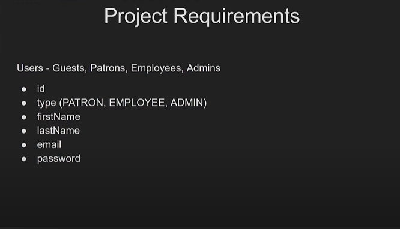
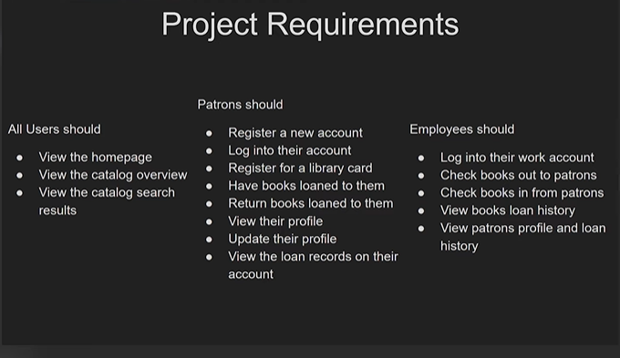
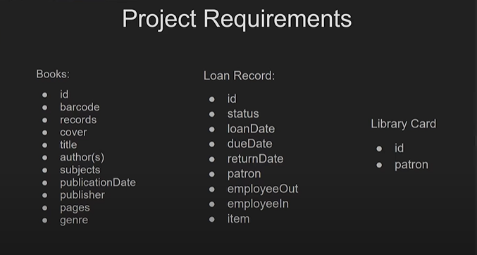
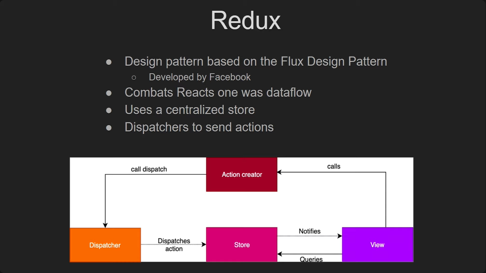
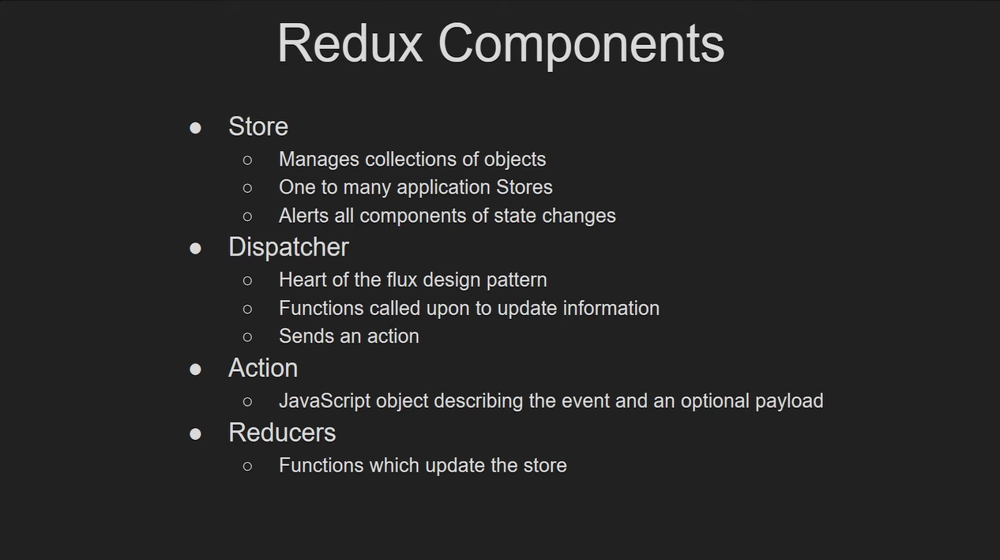

# LEARNING-TAGS

## TAG-01

### Describe me what is the responsibility for which command

```json
"scripts": {
    "build": "rimraf dist && tsc",
    "prestart": "npm run build",
    "start": "node ./dist/server.js",
    "predev": "npm run build",
    "dev": "concurrently \"tsc -w\" \"nodemon ./dist/server.js\""
  },
```

Here's a breakdown of the commands in your `scripts` section:

1. **`build`**: This command cleans up the `dist` directory using `rimraf` (a tool for deleting files and directories) and then compiles TypeScript code into JavaScript using the TypeScript compiler (`tsc`).

2. **`prestart`**: This command is executed before the `start` command. It runs the `build` script to ensure that the project is built before starting the application.

3. **`start`**: This command starts the Node.js application by running the JavaScript file `server.js` located in the `dist` directory. It is typically used for production environments.

4. **`predev`**: This command is executed before the `dev` command. It runs the `build` script to ensure the project is built before starting the development server.

5. **`dev`**: This command is used for development purposes. It runs two processes concurrently:
   - `tsc -w`: Starts the TypeScript compiler in watch mode to automatically recompile TypeScript files when changes are detected.
   - `nodemon ./dist/server.js`: Starts the Node.js application using `nodemon`, which watches for changes in the `dist` directory and restarts the server when changes are detected.

## TAG-02

### Describe me what is the responsibility for opt 1, opt 2, and opt 3 in the code

```json
app.get("/", (req: Request, res: Response) => {
  // OPT 1
  res.status(200).send("Server is running");
  // OPT 2
  res.status(200).json({ message: "Server is running" });
  // OPT 3
  res.status(200).send({ message: "Server is running" });
});
```

In the provided code, each option (OPT 1, OPT 2, and OPT 3) handles the response sent back to the client when the root route (`"/"`) is accessed. Here is the description of the responsibilities for each option:

1. **OPT 1:**
   ```json
   res.status(200).send("Server is running");
   ```
   - This option sends a plain text response with the status code `200 OK`.
   - The response body is a string: `"Server is running"`.
   - This is suitable for simple health checks where only a plain text message is needed.

2. **OPT 2:**
   ```json
   res.status(200).json({ message: "Server is running" });
   ```
   - This option sends a JSON response with the status code `200 OK`.
   - The response body is a JSON object: `{ "message": "Server is running" }`.
   - This is useful when the client expects a JSON response, which is common in APIs.

3. **OPT 3:**

   ```json
   res.status(200).send({ message: "Server is running" });
   ```
   
   - This option also sends a JSON response with the status code `200 OK`, similar to OPT 2.
   - The `send` method can accept an object, and Express will convert it to JSON.
   - The result is effectively the same as OPT 2, producing a response body of `{ "message": "Server is running" }`.

In summary:

- OPT 1 sends plain text.
- OPT 2 sends JSON with proper content-type.
- OPT 3 sends an object that Express may automatically format as JSON





